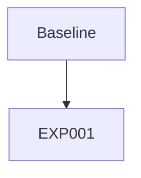

# Experiment Tracker

## Experiment Graph

## Active Thread
**Current Goal:** Template ready for use. Create new experiments branching from EXP001.

## Experiments

| ID | Parent | Status | Description |
|----|--------|--------|-------------|
| EXP001 | ROOT | ✅ done | CIFAR-10 CNN baseline (~85% acc) |

## History
- **EXP001**: Baseline CNN verified. Template functional.
