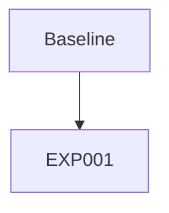

# Experiment Tracker

## Experiment Graph

## Active Thread
**Current Goal:** Template ready for use. Create new experiments branching from EXP001.

## Experiments

| ID | Parent | Status | Description |
|----|--------|--------|-------------|
| EXP001 | ROOT | ✅ done | CIFAR-10 CNN baseline (~85% acc) |

Status: `planned` → `running` → `done` / `failed`

## History

### EXP001 (2025-01-29)
- **Goal**: Verify template works end-to-end
- **Result**: ✅ ~85% accuracy on CIFAR-10
- **Next**: Use as baseline for future experiments

<!-- 
### EXPXXX (YYYY-MM-DD)
- **Goal**: Brief description
- **Result**: ✅/❌ What happened
- **Next**: What follows from this
-->
