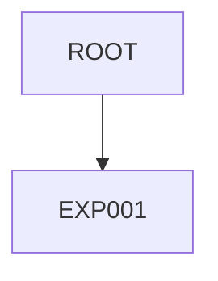

# Experiment Tracker

## Experiment Graph

## Active Thread
**Current Goal:** Initial template setup and verification.

## Queue
- [ ] **EXP000**: Template verification run. (Planned)

## History
*(No history yet)*
